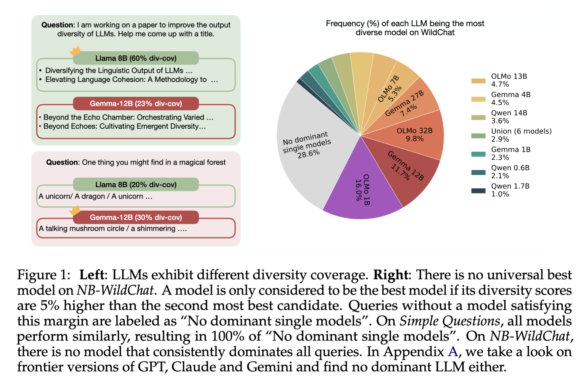

<h1 align="center">Diversity Router</h1>

<p align="center">
  <em>No Single Best Model for Diversity: Learning a Router for Sample Diversity</em>
</p>

<p align="center">
  <a href="https://diversity-router.github.io/">🌐 Website</a> ·
  <a href="https://arxiv.org/pdf/2604.02319">📜 Paper</a> ·
  <a href="https://huggingface.co/datasets/yuhan-nlp/diversity-router-data">🤗 Data</a>
</p>

<p align="center">
  
</p>

<p align="center">
  <sub><b>Left:</b> LLMs exhibit different diversity coverage on the same query. <b>Right:</b> No universal best model on <em>NB-WildChat</em>; different models win on different queries.</sub>
</p>

---

## Overview

When prompts admit many valid answers, no single LLM dominates at generating a
comprehensive, diverse set of responses. This repo introduces:

- **Diversity Coverage** — a new metric that jointly measures the *quality* and
  *uniqueness* of an answer set.
- **A learned router** — given a query, predicts the best LLM (out of 18) for
  diverse generation. On *NB-WildChat*, our router hits **26.3%** diversity
  coverage vs. **23.8%** for the single best-model baseline, and generalizes
  to the out-of-domain *NB-Curated* set.

Published at **COLM 2026**.

---

## Table of Contents

- [Environment Setup](#environment-setup)
- [Download Data](#download-data)
- [Optional: Derive CSVs from Raw Results](#optional-derive-csvs-from-raw-results)
- [Build Per-Model Query Encodings](#build-per-model-query-encodings)
- [Run Experiments](#run-experiments)
  - [Baselines](#baselines)
  - [KNN Classifier](#knn-classifier)
  - [MLP Classifiers](#mlp-classifiers)
  - [Binary Classifiers](#binary-classifiers)
  - [BERT Classifier](#bert-classifier)
- [Core Metrics](#core-metrics)
- [Candidate Models](#candidate-models)
- [Citation](#citation)

---

## Environment Setup

```bash
conda create -n diversity_router python=3.10
conda activate diversity_router
pip install -r requirements.txt
```

> **Note:** `requirements.txt` pins PyTorch to CUDA 12.8 (`torch==2.7.0+cu128`).
> For a different CUDA version, install PyTorch separately first
> ([pytorch.org](https://pytorch.org/get-started/locally/)) and then run
> `pip install -r requirements.txt`.

---

## Download Data

Pre-computed model generations and scores are on HuggingFace:

🤗 **[yuhan-nlp/diversity-router-data](https://huggingface.co/datasets/yuhan-nlp/diversity-router-data)**

These serve as input to `diversity_router/process_cumsum.py`.

---

## Optional: Derive CSVs from Raw Results

If you have access to the raw generation results, reproduce the CSV files with:

```bash
python diversity_router/process_cumsum.py --data wildchat
```

Reads from `results/longform_qa_wildchat/` and writes to
`outputs_18_models/wildchat/list_all/`.

---

## Build Per-Model Query Encodings

To recompute per-model query encodings (requires GPU and HuggingFace model
access):

```bash
python diversity_router/encode_query_by_model/construct_query_encode_per_model.py \
    --data wildchat \
    --strategy list_all \
    --model llama-3.2-1b \
    --batch_size 4
```

Replace `--model` with any of the 18 supported model names (see
`MODEL_NAME_MAP` in the script). Outputs are written to
`outputs_18_models/wildchat/list_all/query_encode_per_model/<model>/`.

---

## Run Experiments

All experiments use `--data_dir outputs_18_models --output_dir outputs_18_models`.
Results (accuracy and cumsum metrics) are written as JSON logs under the
output directory.

### Baselines

**Best-overall baseline** — automatically computed inside each classifier
script if not provided.

**Frequency baseline** — predicts by training-set label frequency:

```bash
python diversity_router/frequency_baseline.py \
    --csv_path outputs_18_models/wildchat/list_all/best_model_per_query.csv
```

### KNN Classifier

```bash
python diversity_router/knn_classifier.py \
    --data wildchat --strategy list_all --k 5 \
    --data_dir outputs_18_models --output_dir outputs_18_models
```

### MLP Classifiers

**Single classifier, universal encoding:**

```bash
python diversity_router/mlp_classifier.py \
    --data wildchat --strategy list_all \
    --n_epochs 10 --hidden_dim 512 \
    --data_dir outputs_18_models --output_dir outputs_18_models
```

**Single classifier, model-specific encoding:**

```bash
python diversity_router/mlp_classifier_n_model_en.py 
        --data wildchat \
        --strategy list_all \
        --n_epochs 10 \
        --hidden_dim 512 \
        --soft_labels \
        --data_dir outputs_18_models \
        --output_dir outputs_18_models \
        --per_model_enc_embed concat_truncated \
        --truncate_dim 200
```

### Binary Classifiers

**One classifier per model, universal encoding:**

```bash
python diversity_router/mlp_classifier_n.py \
    --data wildchat --strategy list_all \
    --n_epochs 10 --hidden_dim 512 --soft_labels \
    --data_dir outputs_18_models --output_dir outputs_18_models
```

**One classifier per model, model-specific encoding:**

```bash
python diversity_router/mlp_classifier_n_model_en.py \
    --data wildchat --strategy list_all \
    --n_epochs 10 --hidden_dim 512 \
    --data_dir outputs_18_models --output_dir outputs_18_models
```

### BERT Classifier

```bash
python diversity_router/bert_classifier.py \
    --data wildchat --strategy list_all \
    --n_epochs 3 --model_name google-bert/bert-base-uncased \
    --exp "bert_wildchat" --soft_labels \
    --data_dir outputs_18_models --output_dir outputs_18_models
```

---

## Core Metrics

| Code name                            | Metric             |
| ------------------------------------ | ------------------ |
| `test_accuracy`                      | Accuracy           |
| `predicted_unique_mean`              | Uniqueness         |
| `predicted_quality_mean`             | Quality            |
| `predicted_unique_quality_mean`      | Unique Quality     |
| `predicted_cumsum_mean / 500 * 100%` | Diversity Coverage |

---

## Candidate Models

The 18 candidate models used in this study:

| Family    | Models                                                                          |
| --------- | ------------------------------------------------------------------------------- |
| **Llama** | llama-3.2-1b, llama-3.2-3b, llama-3.1-8b, llama-3.3-70b                         |
| **Qwen**  | qwen3-0.6b, qwen3-1.7b, qwen3-4b, qwen3-8b, qwen3-14b, qwen2.5-72b-instruct     |
| **Gemma** | gemma-3-1b-it, gemma-3-4b-it, gemma-3-12b-it, gemma-3-27b-it                    |
| **OLMo**  | olmo-2-0425-1b, olmo-2-1124-7b, olmo-2-1124-13b, olmo-2-0325-32b                |

---

## Citation

If you find this work useful, please cite:

```bibtex
@inproceedings{liu2026diversity,
  title     = {No Single Best Model for Diversity: Learning a Router for Sample Diversity},
  author    = {Liu, Yuhan and Xu, Fangyuan and Padmakumar, Vishakh and Ippolito, Daphne and Choi, Eunsol},
  booktitle = {Conference on Language Modeling (COLM)},
  year      = {2026}
}
```
